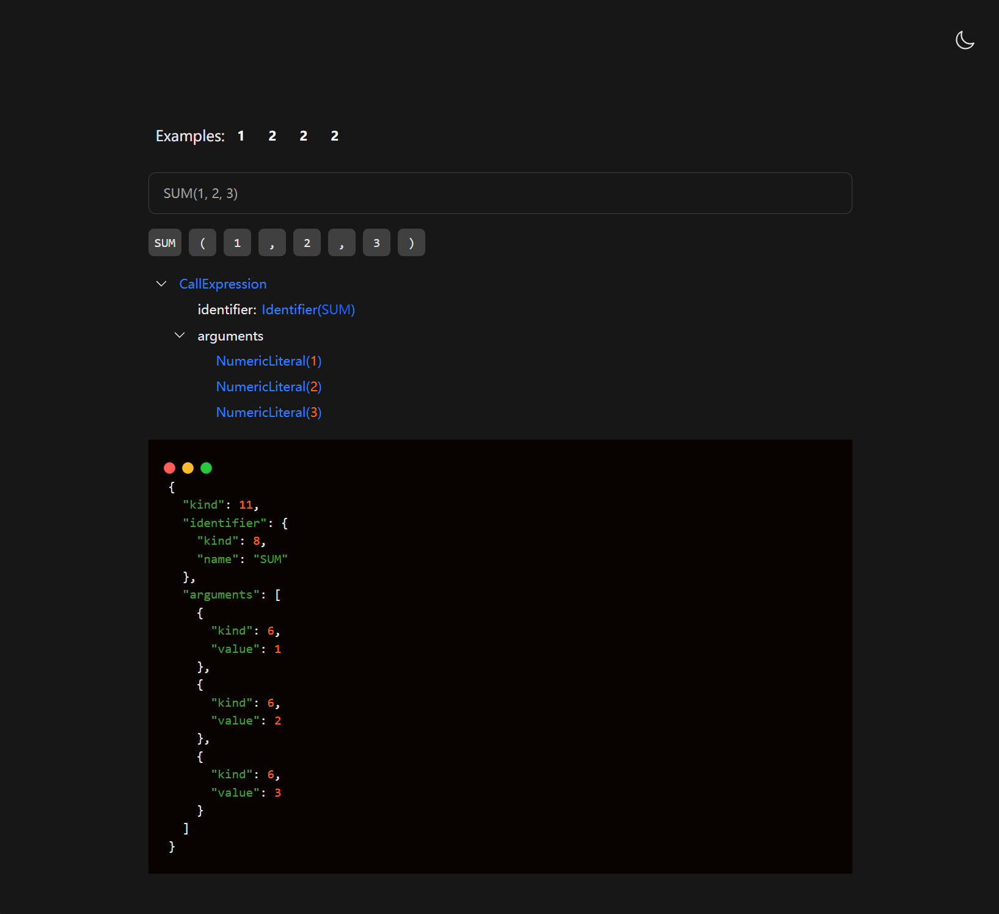
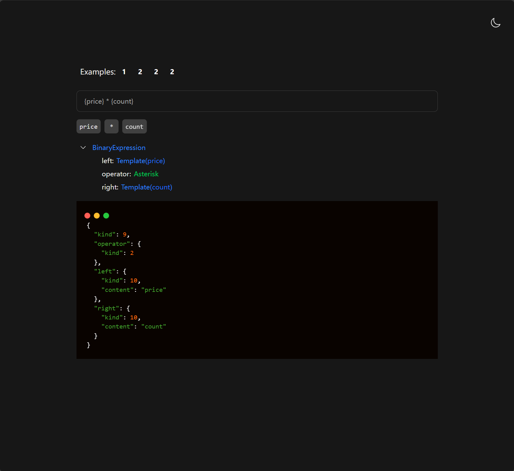
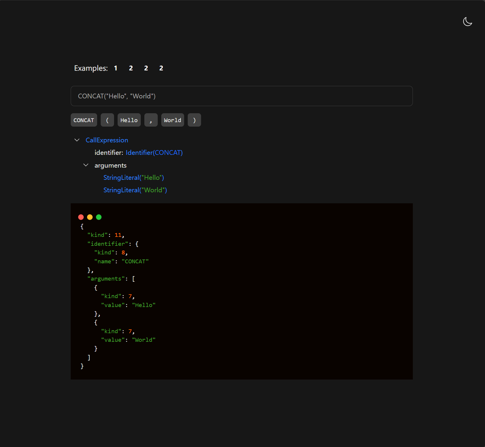

# 表达式解析器 | Expression Parser (TypeScript)

这是一个使用TypeScript编写的表达式解析器练习项目，具有直观美观的在线游乐场界面。该项目实现了一个完整的表达式解析器，支持四则运算、函数调用、变量引用等功能，并提供了可视化的词法分析和抽象语法树展示。

## ✨ 特点

- ✅ 支持基本四则运算与括号优先级
- ✅ 支持函数调用（如`SUM(1, 2, 3)`）
- ✅ 支持变量引用（如`{price} * {count}`）
- ✅ 词法分析器(Lexer)和语法解析器(Parser)的完整实现
- ✅ 美观的在线游乐场，支持表达式的实时解析展示
- ✅ 直观的抽象语法树(AST)可视化
- ✅ 代码高亮和暗黑模式支持

## 📸 效果展示

<details>
<summary> 这里是效果展示 </summary>






</details>


## 🚀 快速开始

### 在线使用

访问我们的[在线演示(备案中)](http://play-expression-parser.yefu24324.com) -> [备用链接](http://43.139.15.54:22012)

### 前提条件

确保已安装以下工具:
- Node.js (v22+)
- pnpm

### 本地运行

1. 克隆此仓库
```bash
git clone https://github.com/yefu24324/play-expression-parser.git
cd play-expression-parser
```

2. 安装依赖
```bash
pnpm install
```

3. 启动开发服务器
```bash
pnpm dev
```

4. 打开浏览器访问 `http://localhost:3000`

### 运行测试

```bash
pnpm test
```

## 构建与部署

1. 构建项目
```bash
pnpm build
```

2. 运行生产服务器
```bash
pnpm serve
```

## 🔧 技术栈
- [TypeScript](https://www.typescriptlang.org/) - **核心解析器**
- [SolidJS + SolidStart](https://docs.solidjs.com/) - 高性能的前端框架
- [Vite](https://cn.vite.dev/) - 下一代前端构建工具
- [TypeScript](https://www.typescriptlang.org/) - JavaScript的超集语言
- [Tailwind CSS](https://tailwindcss.com/) - 实用的CSS框架
- [CodeMirror 6](https://codemirror.net/) - 代码编辑器
- [Vinxi](https://vinxi.vercel.app/) - 基于Vite的构建工具
- [Vitest](https://cn.vitest.dev/) - 测试框架

## 🧩 项目结构

```
./     
├─libs
│  └─expression-parser-ts          // 表达式解析器核心库
│      ├─src                       
│      │  ├─ast-nodes/             // 抽象语法树节点定义
│      │  ├─lexer.ts               // 词法分析器
│      │  ├─parser.ts              // 语法解析器
│      │  └─...                    // 其他工具函数
│
└─src                              // 在线游乐场前端
    ├─components                  
    │  └─expression-viewer/        // 表达式可视化组件
    ├─routes                       // 应用路由
    └─...                          // 其他前端资源
```

## 👨‍💻 作者

- 夜浮卿 (yefu) - [GitHub](https://github.com/yefu24324)

## 📝 计划

- 实现表达式执行器, 用户运行表达式并查看结果
- 支持更多的内置函数和运算符
- 添加更多的测试用例和文档
- 支持交互的动画效果
- 实现CodeMirror 6的表达式输入框
- 为表达式添加类型检查和错误提示
